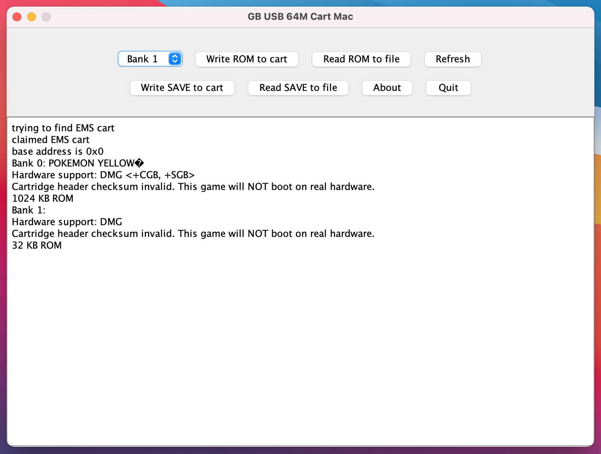

# GB USB 64M Cart Mac

macOS app for the “GB USB Smart Card 64M” Gameboy cartridge. 💾

This app provides a simple GUI for EMS Flasher by Mike Ryan. It should make life easier for those not familiar with terminal commands or anyone looking for a quicker way to manage their cartridge.

 

 

**Download:** https://github.com/hexensemble/gb-usb-64m-cart-mac/releases

 

Tested and working on Intel based Mac running macOS Big Sur.

**IMPORTANT:** You will need to right click the application then click 'open' before macOS will let you use it. The first time you do this it will fail but the second attempt will work.
